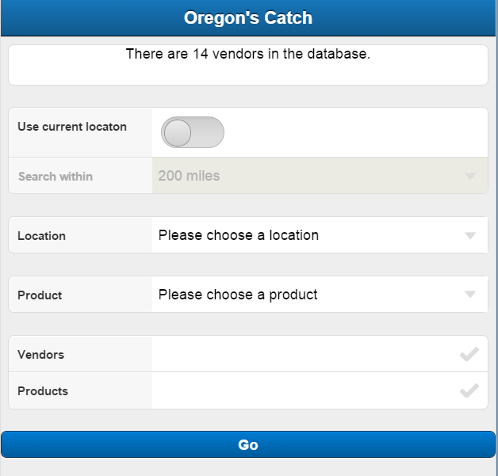

Home Page Documentation
=======================
	The home screen contains all the tools you need to specify where and what you are looking for.
*	The search results lets you know imediately how many results your query has netted you.
*	The userlocation field is used to find products and vendors near your location depending on the proximity settings.
*	The distance field sets how far away from your location you want to search for vendors or products.
*	The location field specifys a city you want to look for products or vendors in.
*	The products field is used to specify what type of product you are looking for.
*	The vendors and products checkboxes specify what kind of data your search will return.
*	The go button sends you to view your results.
..	note :: NOTE: Only user location or location field can be used at one time.
